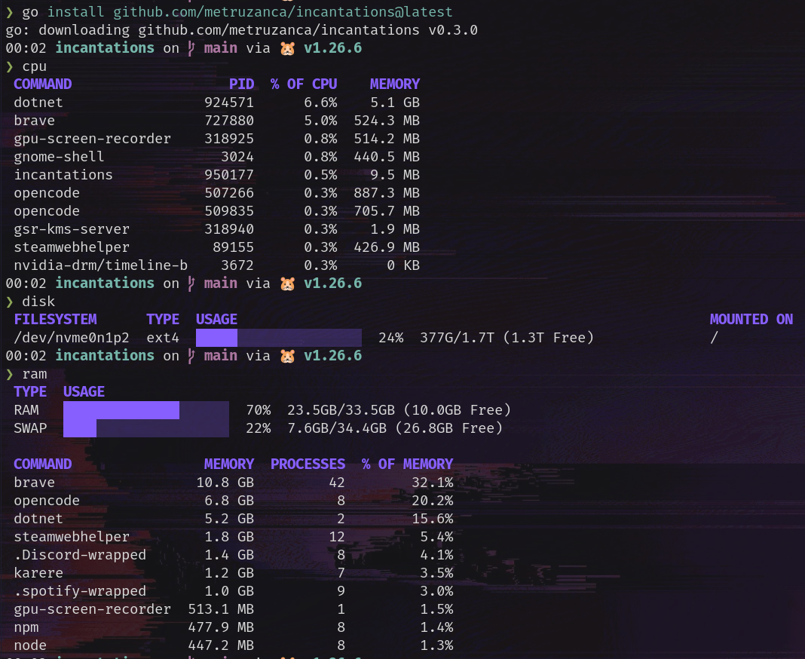

# Incantations

Small system utilities for people who don't remember the linux incantations.

Instead of recalling `ps aux | sort -rk 4` or `df -h | grep -v tmpfs`,
type `ram`, `cpu`, or `disk`.



## What you get

| Command | What it shows |
| --- | --- |
| `ram` | RAM and swap usage with a usage bar, plus the top memory hogs |
| `cpu` | The top CPU hogs; add `-t` for the utilization breakdown and load average |
| `disk` | Disk usage per real filesystem with a usage bar; `-a` shows small partitions |
| `space` | Which directories are eating your home, biggest first; `space [PATH]` drills elsewhere |
| `ports` | Which TCP ports are listening, grouped by process; `ports 8080` checks one; `--stop`/`--kill` signal a port; `--udp`/`--ipv6` show the rest |
| `net` | Per-interface IP addresses (IPv4) and live transfer rates; `--ipv6` and `-a` reveal the rest |
| `battery` | Charge state, drain/charge rate, time remaining (prints a notice on desktops with no battery) |

## Install

```sh
go install github.com/metruzanca/incantations@latest
```

New versions are published as git tags, so `go install ...@latest` always
picks up the newest release (or pin one with `@v0.x.y`).

## Set up your shell

Run `incantations init` once and follow its advice for your shell.

## Examples

### ram

Replaces `free -h` plus the "what's eating my memory?" yak-shave through
`ps`. RAM and swap get a usage bar; below them, the processes using the most
memory (grouped by name, all instances summed).

```
$ ram
 TYPE   USAGE                                                  
 RAM    ███████████░░░░░░░░░  55%  18.5GB/33.5GB (15.0GB Free) 
 SWAP   ████████████░░░░░░░░  61%  5.6GB/9.1GB (3.6GB Free)    

 COMMAND   MEMORY  PROCESSES  % OF MEMORY 
 chrome    1.5 GB          1         4.4% 
 kthreadd  2.1 MB          1         0.0% 
```

### cpu

Replaces `ps aux --sort=-%cpu | head`. The most CPU-hungry processes, plus
their memory. Percentages are of the whole CPU (all cores combined), not of a
single core.

```
$ cpu
 COMMAND               PID  % OF CPU  MEMORY 
 web server (worker)  4321     99.9%  1.5 GB 
 kthreadd              555      1.2%  2.1 MB 
```

The utilization breakdown and load average are usually noise, so they're
tucked behind `cpu -t` (also available as `sys -t`):

```
$ cpu -t
Programs        9.3%
System          2.9%
Idle           87.8%
Load (1m 5m 15m) 2.01 1.83 1.77

 COMMAND            PID  % OF CPU  MEMORY 
 opencode            533343      4.5%  900 MB  
 gpu-screen-recorder  318925      1.7%  448 MB  
 gnome-shell          3024       0.8%  459 MB  
```

### disk

Short for `df -hT | grep -v tmpfs`. Usage per real filesystem, fullest first,
with a bar per row. Small filesystems (like a sub-1GB `/boot`) are hidden by
default to cut noise; show everything with `disk -a` (or `--all`).

```
$ disk
 FILESYSTEM        TYPE  USAGE                                             MOUNTED ON 
 nfs:/data/shared  nfs4  ████████████████░░░░  81%  3.2T/4.0T (800G Free)  /mnt/shared
 /dev/nvme0n1p2    ext4  █████░░░░░░░░░░░░░░░  24%  377G/1.7T (1.3T Free)  /
```

### space

`space` answers "what's eating my disk" instead of "which partition is full":
the biggest directories under a path, each bar showing its share of the whole
tree. Without a PATH it scans your home directory; with one it scans that
path. It replaces `du -xhd1 ~ | sort -rh | head`.

Because it walks every file, this one is slow on big directories — tens of
seconds on a full home, longer over a network mount. Directory sizes under
1 GB are hidden by default; show them with `space -a` (or `--all`).

```
$ space
409.8G used in /
 DIRECTORY  USAGE
 home       ███████████████░░░░░  75%  305.7G
 nix        ███░░░░░░░░░░░░░░░░░  14%  55.4G
 var        ░░░░░░░░░░░░░░░░░░░░   3%  11.0G
```

### ports

Replaces `ss -tulpn` (or the `lsof -i` dance). Which TCP ports are listening,
grouped by the process that owns them, local ports first; well-known ports are
labeled from `/etc/services`. `ports 8080` checks a single port.

UDP sockets and IPv6 addresses are usually not what you're looking for, so
both are hidden by default: pass `--udp` to include UDP and `--ipv6` to
include the IPv6 listeners.

`ports --stop 8080` (SIGTERM) or `--kill 8080` (SIGKILL) shuts down whatever
is listening on that port — a stray dev server can be killed from the same
command that tells you its pid, no `fuser`/`lsof` incantation required. It
only signals processes you own; another user's (or root's) listener needs
sudo. Sockets without a shown PID (so invisible without root) are grouped
under `-`, but every listening port is still listed.

```
$ ports
 PROCESS            PID  PROTO  LOCAL ADDRESS
 .spotify-wrappe   3195  tcp    0.0.0.0:57621
                          tcp    0.0.0.0:59113
 steam            87285  tcp    0.0.0.0:27036
                          tcp    127.0.0.1:27060
 -                    -  tcp    0.0.0.0:22 (ssh)
                          tcp    127.0.0.1:631 (ipp)
```

Sockets without a shown PID (other users' processes, so invisible without
root) are grouped under `-`, but every listening port is still listed.

### net

Per-interface IP addresses and live download (RX) and upload (TX) speeds,
replacing an `ip addr` + `ifstat` combo. Rates are measured over about one
second, so `net` takes roughly that long. The loopback interface and IPv6
addresses are noise for most people, so both are hidden by default: include
loopback with `net -a` (or `--all`), and show IPv6 with `net --ipv6`. Idle
interfaces show `-` for both rates.

```
$ net
 INTERFACE   STATUS  IP ADDRESSES  RECEIVE     TRANSMIT
 wlp5s0      up      192.168.1.151  23.9 KB/s   4.8 KB/s
 tailscale0  up      100.106.143.56  -           -
```

### battery

Charge state and power draw from laptop sysfs, with an estimate of time
remaining (to empty when discharging, to full when charging) and the battery's
design health (a marker of wear). On a desktop — a machine with no battery —
it prints `No battery found.` rather than failing.

```
$ battery
 TYPE     STATE        USAGE
 BATTERY  Discharging  ████████░░░░░░░░░░░░  38%  37.8Wh/79.3Wh (41.5Wh left)
Rate 22.0 W · 1h 42m left · Design health 88%
```
